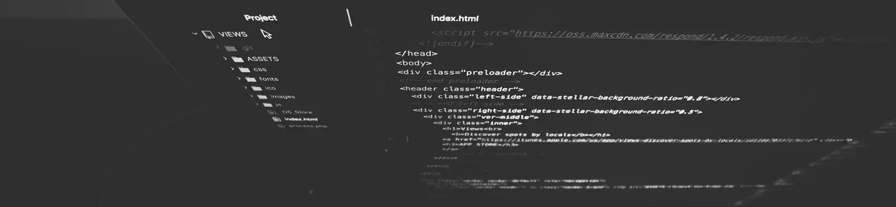

### hiya! 👋
My name is **Michał Rogoziński** and I aspire to be a Front End Developer in the future. Currently I'm in halfway of studying [**Colt Steele's Bootcamp**](https://github.com/rogozinski/courses) and doing some webdesigning challenges at [**FrontEndMentor**](https://www.frontendmentor.io/profile/rogozinski). If you 
see me as a perfect match for your company feel feel to contact me at:

**Linkedln:** https://www.linkedin.com/in/rogozinskim/

**Facebook:** https://www.facebook.com/rogozinski.m

<!--
**rogozinski/rogozinski** is a ✨ _special_ ✨ repository because its `README.md` (this file) appears on your GitHub profile.

Here are some ideas to get you started:

- 🔭 I’m currently working on ...
- 🌱 I’m currently learning ...
- 👯 I’m looking to collaborate on ...
- 🤔 I’m looking for help with ...
- 💬 Ask me about ...
- 📫 How to reach me: ...
- 😄 Pronouns: ...
- ⚡ Fun fact: ...
-->
